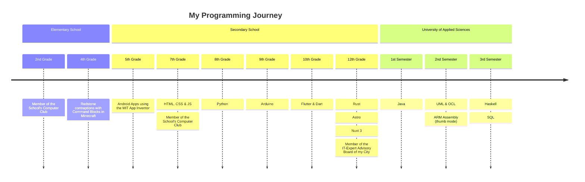

<h1 align="center">👋 Hey there, I'm AstragoDE</h1>

<!-- Badges -->

    

    

    
    
    

 

Hi, I am AstragoDE.

I'm a computer science student from Germany and I like programming stuff.

## My skills 🎯

I am able to plan, develop and maintain a full application stack by using the following technologies:

- Rust
- Java
- Python 3
- Haskell
- Astro & Tailwind CSS
- Docker
- Nginx
- Git
- Typst

## My Programming Journey 🧭

## My Projects 🏗️

- [Rust Template](https://git.astrago.de/AstragoDE/rust-template) - A simple Rust Template including a logger

## My Code 💻

- [**[AstraGit]**](https://git.astrago.de/AstragoDE): My core projects can be found here.
- [**[Codeberg]**](https://codeberg.org/AstragoDE): Community-oriented projects are located here.
- [**[GitHub]**](https://github.com/AstragoDE): Old projects and contributions to projects hosted on GitHub can be found here. New Repositories will be added on AstraGit or Codeberg exclusively.

## My Goals 🥅

- Continue learning [Rust](https://www.rust-lang.org/)
- Learn [PostgreSQL](https://www.postgresql.org/)

## Contact 📬

You can get in touch with me via [this Google Form](https://docs.google.com/forms/d/e/1FAIpQLSdOZ5kqCVAjom2DfaeiOooklw_xfUqaf9RN1v2X53nldh200w/viewform?usp=sf_link) or via my [Discord Support Server](https://discord.gg/bmHmDW39NH).

Discord Status

