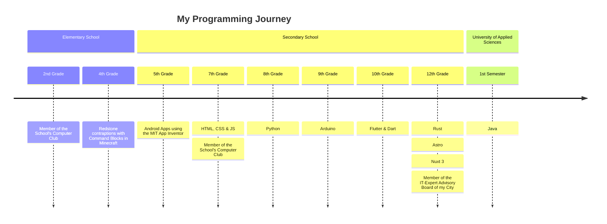

<h1 align="center">👋 Hey there, I'm AstragoDE</h1>

<!-- Badges -->

    

    

    
    
    
    

 

Hi, I am AstragoDE.

I'm a computer science student from Germany and I like programming stuff.

## My skills 🎯

I am able to plan, develop and maintain a full application stack by using the following (and more) technologies:

- Rust
- Python 3
- Astro, Nuxt 3, HTML, CSS & Tailwind CSS
- Docker
- Nginx
- Git & GitHub
- Typst

Please note that I am not an expert in all of these technologies. I am still learning and improving my skills.

## My Programming Journey 🧭

```mermaid
timeline
    title My Programming Journey

    section Elementary School
        2nd Grade   : Member of the School's Computer Club
        4th Grade   : Redstone contraptions with Command Blocks in Minecraft

    section Secondary School
        5th Grade   : Android Apps using the MIT App Inventor
        7th Grade   : HTML, CSS & JS
                    : Member of the School's Computer Club
        8th Grade   : Python
        9th Grade   : Arduino
        10th Grade  : Flutter & Dart
        12th Grade  : Rust
                    : Astro
                    : Nuxt 3
                    : Member of the IT-Expert Advisory Board of my City

    section University of Applied Sciences
        1st Semester: Java
```

## My Projects 🏗️

- [Rust Template](https://github.com/AstragoDETechnologies/rust-template) - A simplistic Rust Template
- [Teachers' Lounge Information System](https://github.com/WieSeTechnologies/astroTLIS) for [PGWV](http://pgwv.de) - A Webpage for an information display / Digital Signage
- [YouTube Chapter Auto Open](https://github.com/AstragoTech/youtube_chapter_auto_open) (Userscript)
- [Disable Dead Keys on a German Keyboard](https://github.com/AstragoDETechnologies/disable-dead-keys-german-keyboard) - An AutoHotkey Script

## My Goals 🥅

- Continue learning [Rust](https://www.rust-lang.org/)
- Learn [PostgreSQL](https://www.postgresql.org/)
- Learn [SvelteKit](https://kit.svelte.dev/)

## Contact 📬

You can get in touch with me via [this Google Form](https://docs.google.com/forms/d/e/1FAIpQLSdOZ5kqCVAjom2DfaeiOooklw_xfUqaf9RN1v2X53nldh200w/viewform?usp=sf_link) or via my [Discord Support Server](https://discord.gg/bmHmDW39NH).

Discord Status

## My Statistics 📊

My GitHub Stats

    

My Weekly Coding Stats

    

My GitHub Contribution Graph

    

## My Organizations 🏢

For the sake of better organization, my projects are split up into multiple GitHub organizations.
This way, I can keep my personal projects separate from my school projects and my miscellaneous projects.

- [AstragoDE Technologies](https://github.com/AstragoDETechnologies) for personal projects (most of my projects are here)
- [WieSe Technologies](https://github.com/WieSeTechnologies) for projects I develop with my friend @byRaiZe
- [AstragoDE Education](https://github.com/AstragoDEEducation) for school & [UAS](https://en.wikipedia.org/wiki/Fachhochschule) projects not belonging to their respective oranizations
- [AstragoDE Sharing](https://github.com/AstragoDESharing) for sharing code (mostly snippets)
- [AstragoDE Miscellaneous](https://github.com/AstragoDEMiscellaneous) for miscellaneous purposes (e.g. learning, testing, tinkering, etc.)
- [Informatik - PGWV](https://github.com/InformatikPGWV) for computer science projects (secondary school (2021 - 2024))

<!-- 

 -->

<!-- ### My GitHub Commits (Skyline) 🌃 -->
<!-- - [2025 GitHub Skyline](https://skyline.github.com/astragode/2025) -->
<!-- - [2024 GitHub Skyline](https://skyline.github.com/astragode/2024) -->
<!-- - [2023 GitHub Skyline](https://skyline.github.com/astragode/2023) -->
<!-- - [2022 GitHub Skyline](https://skyline.github.com/astragode/2022) -->
<!-- - [2021 GitHub Skyline](https://skyline.github.com/astragode/2021) -->
<!-- - [2020 GitHub Skyline](https://skyline.github.com/astragode/2020) -->

    
© 2022 - 2025 <a href="https://gh.astrago.de">AstragoDE</a>

